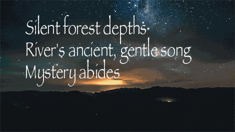

# 👋 Welcome to my corner of GitHub!

## ✨ Today's Haiku ✨

  

The daily haiku you see above is the product of a GitHub Actions workflow where:

1.  🐝 Three different Large Language Models (LLMs) each independently create a haiku.
2.  ⚖️ These LLMs then review and rate all three generated haikus on a scale of 1 (Poor) to 5 (Excellent) based on the haiku's adherence to the 5-7-5 syllable structure and its general poetic merit (clarity of imagery, emotional resonance, conciseness, effective word choice, and originality).
3.  🏆 The haiku with the highest mean score is chosen as the winner and automatically displayed above!

🔍 Want to see the scores and how each LLM voted? Click here for today's detailed results!

| Haiku | Generated By | Rated by `Llama 4 Scout` | Rated by `Llama 3.3` | Rated by `Llama 3.1` | Mean Score | Std Dev | Status |
| :---------------------------------------------- | :----------- | :----------------- | :---------------- | :----------------- | :--------- | :--------- | :-------- |
*Softly glows the ember Golden sparks within the ash Winter's final breath* | Llama 4 Scout | 4 / 5 | 5 / 5 | 4 / 5| 4.33 | 0.5774 | 🏆 Winner |
*Tranquil forest heart Ancient trees in mystic sleep Nature's gentle pulse* | Llama 3.3 | 3 / 5 | 5 / 5 | 5 / 5| 4.33 | 1.1547 |  |
*Softly wraps the fog   Shadows dance upon the trees   Morning's quiet grasp* | Llama 3.1 | 4 / 5 | 5 / 5 | 2 / 5| 3.67 | 1.5275 |  |

## 🧪 Welcome to the Lab!

This repository is a sandbox for exploring what happens when LLMs get creative together. 

My  goal is to learn, to play, and to showcase the wild and wonderful things LLMs can do. Unexpected results, odd turns of phrase, and delightful glitches are all part of the fun.

### 💬 Feedback is welcome!

Spotted something strange or brilliant? Got ideas? **I’d love to hear from you!**