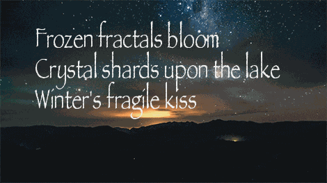

# 👋 Welcome to my corner of GitHub!

## ✨ Today's Haiku ✨

  

The daily haiku you see above is the product of a GitHub Actions workflow where:

1.  🐝 Three different Large Language Models (LLMs) each independently create a haiku.
2.  ⚖️ These LLMs then review and rate all three generated haikus on a scale of 1 (Poor) to 5 (Excellent) based on the haiku's adherence to the 5-7-5 syllable structure and its general poetic merit (clarity of imagery, emotional resonance, conciseness, effective word choice, and originality).
3.  🏆 The haiku with the highest mean score is chosen as the winner and automatically displayed above!

🔠Want to see the scores and how each LLM voted? Click here for today's detailed results!

| Haiku | Generated By | Rated by `Llama 4 Scout` | Rated by `Llama 3.3` | Rated by `Llama 3.1` | Mean Score | Std Dev | Status |
| :---------------------------------------------- | :----------- | :----------------- | :---------------- | :----------------- | :--------- | :--------- | :-------- |
*Golden light descends Ripples on the ancient stones Summer's gentle slope* | Llama 4 Scout | 4 / 5 | 5 / 5 | 5 / 5| 4.67 | 0.5774 | 🆠Winner |
*River's gentle voice   Echoes through the canyon walls   Nature's ancient song   Softly sways the grass   Morning breeze upon the hill   Serenity found    Evening's fiery sky   Burns with vibrant, wild desire   Freedom's wild heartbeat* | Llama 3.3 | 3 / 5 | 1 / 5 | 2 / 5| 2.0 | 1.0 |  |
*Softly falls the dew  Morning's gentle touch awakes  Summer's peaceful sigh* | Llama 3.1 | 4 / 5 | 4 / 5 | 4 / 5| 4.0 | 0.0 |  |

## 🧪 Welcome to the Lab!

This repository is a sandbox for exploring what happens when LLMs get creative together. 

My  goal is to learn, to play, and to showcase the wild and wonderful things LLMs can do. Unexpected results, odd turns of phrase, and delightful glitches are all part of the fun.

### 💬 Feedback is welcome!

Spotted something strange or brilliant? Got ideas? **I’d love to hear from you!**